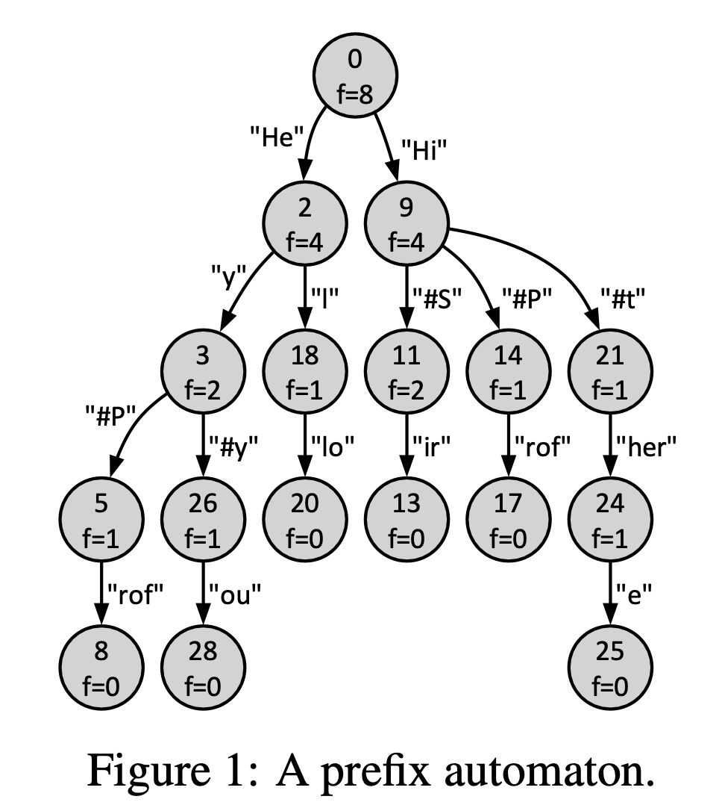
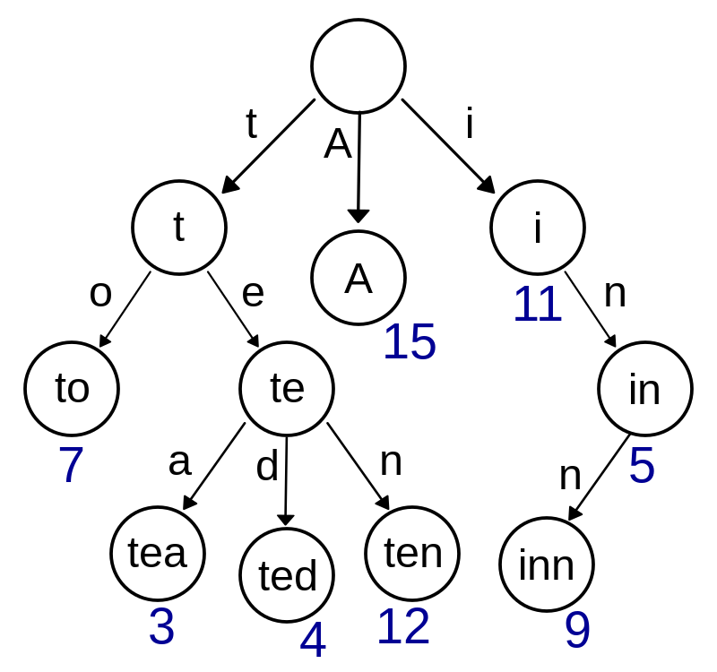

# Assignment 2

## What is a _frequency prefix automaton_?

Artem and Alistair want to design a tool for generating text statements from prompts. In the first version of the tool, they decide to learn a **_frequency prefix automaton_** from training statements. A sample trained automaton is shown in Figure 1.

<center>

</center>

But... what is a frequency prefix automaton? A simple Google search won't yield any insightful results on how to implement it.

However, by looking into the definition given out in the assignment, you can see that it is a [**trie**](https://www.geeksforgeeks.org/introduction-to-trie-data-structure-and-algorithm-tutorials/) and a [**radix tree**](https://en.wikipedia.org/wiki/Radix_tree) data structure.

### [Trie](https://www.geeksforgeeks.org/introduction-to-trie-data-structure-and-algorithm-tutorials/)

<center>

</center>

<br>
A **Trie** is a specialized tree used to store associative arrays, where the keys are usually strings. It is particularly useful for word lookups and auto suggestions.

### [Radix tree](https://en.wikipedia.org/wiki/Radix_tree)

<center>

</center>

<br>
A **Radix Tree**, also known as a **Patricia Tree**, is a compressed trie, optimizing memory usage by merging nodes with a single child with their parents.

## How to solve the assignment

You can consider two approaches: either you want to do it the trie way and solve up to Stage 1 (16 points) or do it the radix tree way up to Stage 2 (20 points). If you’re short on time, I’d say just aim for Stage 1. For comparison, it took me a day to solve up to Stage 1, but now I am only starting on my day 3 of solving up to Stage 2.

### Stage 0

I recommend you look into the [link above](https://www.geeksforgeeks.org/introduction-to-trie-data-structure-and-algorithm-tutorials/) first and understand how trie works.

In a general sense, it is similar to a binary tree. While binary trees have 2 connected nodes, a trie is arbitrary. To handle arbitrarily connected nodes, you can use either 1.) A linked list 2.) A dynamic array 3.) A hashmap. A hashmap implementation is ubiquitous, as it offers the best time complexity overall, O(k), for most operations. However, since the scoring of this assignment is not based on time complexity, either using a linked list provided in the skeleton code or using a dynamic array would suffice.

#### Extra: How to dynamically size anything?

In C, you need to assign memory to everything. You first assign a fixed amount of memory to something; let's say memory for 16 items. Each time you add an item, you check if it is 16 yet; if it is, you allocate more memory to it, for example, increase it by a power of two; 32.

```c
int main() {
    int *array; // Pointer to the dynamic array
    int capacity = 16; // Initial capacity of the array
    int size = 0; // Initial size of the array
    
    // Allocate initial memory
    array = (int *)malloc(capacity * sizeof(int));
    if(!array) {
        printf("Memory allocation failed!\n");
        return 1;
    }
    
    for(int i = 1; i <= 1000; i++) {
        // Check if array is full
        if(size == capacity) {
            capacity *= 2; // Double the capacity
            int *temp = (int *)realloc(array, capacity * sizeof(int));
            if(!temp) {
                printf("Memory reallocation failed!\n");
                free(array);
                return 1;
            }
            array = temp; // Update the array pointer
        }
        
        array[size] = i; // Assign value to the array
        size++; // Increase the size
    }
    
    // Don’t forget to free the allocated memory
    free(array);
    return 0;
}
```

### Stage 1

It is relatively similar to how you loop through your nodes in Stage 0, however, you need to implement some logging function while truncating the output to only 37 characters. This step is by far the easiest given that you can reuse a lot of code from Stage 0.

### Stage 2

Why is it difficult.

1. Instead of each node storing a char, you need each node to store an array of chars (a string).
2. Handling freeing memory in the compression stage is a pain. A real pain ;-;.
3. You also need to continue training the tree using prompts from Stage 1.
